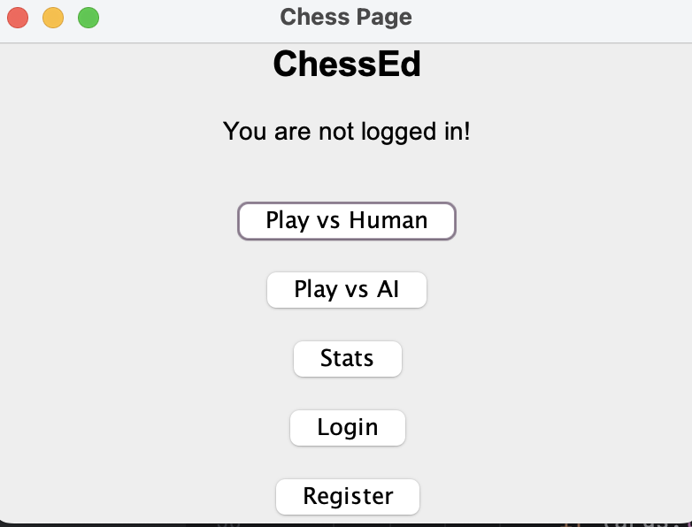
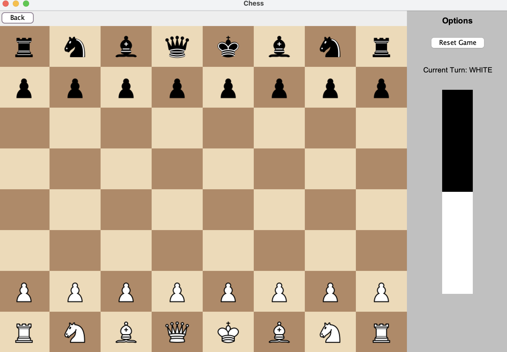
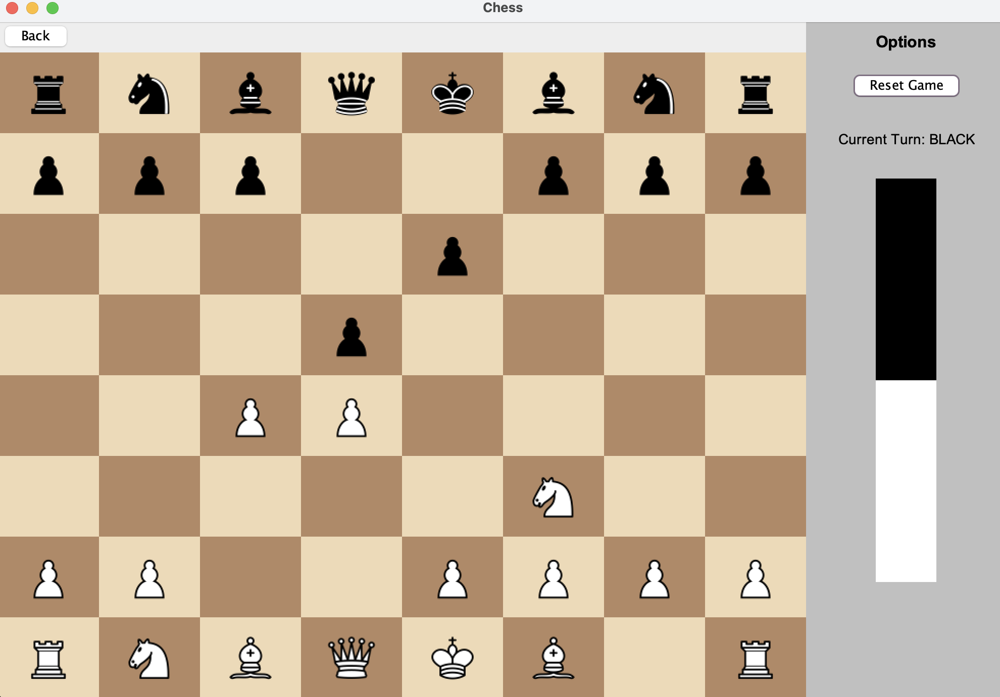

# ChessEd

## About the Project
**ChessEd** is a Java-based Chess application featuring a clean Swing GUI and support for both human (on the same machine) and AI opponents. It includes full Chess gameplay, an intuitive interface, optional database support, and AI-powered move evaluation using a neural network via Python interoperability.

## Features

### Core Gameplay
- **Standard Chess Rules**: Full implementation of legal Chess moves.
- **Graphical Interface**: Easy-to-use Swing-based GUI for an interactive experience.
- **Play vs Human**: Local multiplayer mode where two players can alternate moves on the same device.
- **Play vs AI**: Challenge a computer opponent that uses a neural network for move evaluation.

### AI Move Evaluation
- **Neural Network Model**: A Python-based ML engine evaluates board states for optimal move selection.
- **Alpha-Beta Pruning**: Efficient search using the Alpha-Beta pruning algorithm.
- **Python Interoperability**: Communication between Java and Python handled via TCP sockets.

### Optional Features
- **Player Statistics**: Track and save player data using MySQL (requires database configuration).
- **Console Modes**: Run the application in terminal-only mode with text-based gameplay and rule explanations.
  
## How to Use

When opening the application in gui mode, the user will be greeted by the following main menu.



By clicking "Play vs Human" or "Play vs AI", the user will be navigated to the board. 



To make a move:
1. Click on the piece you want to move.
2. Click on the destination square.
3. If the move is legal, it will be executed. If not, selection will be cleared.

Example: A game after a variation of Queen's Gambit Declined:



Since this application is not meant for competitive play, the user will be able to reset the game (revert all pieces to their original places) at any point by preessing the "Reset Game" button. 

Users will also have the option to Login and Register in order to be able to track their stats, although that requires some tweaks in the code itself.

## Program Arguments
You can run ChessEd in different modes using command-line arguments:

- `gui`: Launches the graphical user interface (default).
- `play`: Runs a 2D terminal-based version of the game.
- `rules`: Displays the rules of chess in the terminal.

## Prerequisites

Before running ChessEd, ensure you have the following installed:

1. **Java Development Kit (JDK) 11 or higher**  
   Required to compile and run the Java application.  
   Download from: [Oracle JDK](https://www.oracle.com/java/technologies/javase-downloads.html) or [OpenJDK](https://openjdk.java.net/install/)

2. **Python 3.8+ (Optional - Only for AI mode)**  
   Required to run the ChessEngine AI.  
   Download from: [Python Official Site](https://www.python.org/downloads/)

3. **ChessEngine (Optional - Only for AI mode)**  
   The neural network-based chess engine must be running locally.  
   Clone and set up from: [https://github.com/Dio1000/ChessEngine](https://github.com/Dio1000/ChessEngine)  
   Follow its README for installation and execution instructions.

4. **MySQL (Optional - Only for database features)**  
   Required if using player stats tracking.  
   Download from: [MySQL Community Server](https://dev.mysql.com/downloads/mysql/)

## Usage

To build the `ChessEd.jar` file yourself, follow these steps:

1. **Clone the repository**:
   ```bash
   git clone https://github.com/Dio1000/ChessEd.git
   cd ChessEd
   ```
   
2. **Compile the project**:
   ```
   mvn clean install
   ```
After building, the ChessEd.jar file will be available in the ```target/``` directory.

### Running the Application
1. **Without AI (Human vs Human)**  
   ```bash
   java -jar ChessEd.jar gui

2. **With AI (Human Vs AI)**
   
   First, start by launching the engine using the instructions here [https://github.com/Dio1000/ChessEngine](https://github.com/Dio1000/ChessEngine)  

   Then, from the application, click the "Play vs AI" button.

## Contact

Email: [sandru.darian@gmail.com](mailto:sandru.darian@gmail.com)  

ChessEd: [https://github.com/Dio1000/ChessEd](https://github.com/Dio1000/ChessEd)  
AI Engine: [https://github.com/Dio1000/ChessEngine](https://github.com/Dio1000/ChessEngine)  
